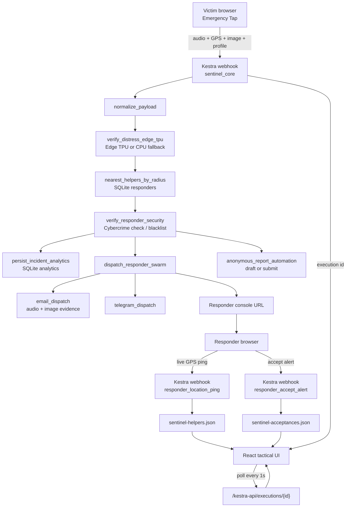

# Sentinel Grid

Sentinel Grid is a Kestra-first emergency response prototype for situations where a person needs fast nearby human help before formal response teams arrive. The frontend is a tactical command surface, but orchestration, verification, dispatch, evidence handling, responder acceptance, and live location persistence are owned by Kestra flows.

The product goal is simple: a person taps an alert, the system captures location/audio/evidence, verifies distress, selects the safest nearby responder, dispatches a responder-specific console link, and lets the victim watch acceptance and movement like a live delivery handoff.

## What It Does

- Sends emergency audio, GPS, optional scene image, and optional victim profile into Kestra.
- Polls the real Kestra execution every second and renders task states from `taskRunList`.
- Shows Kestra task outputs under each topology node, not hardcoded frontend states.
- Verifies registered responders through a Kestra cybercrime/security task before SQLite activation.
- Supports manual responder selection and automatic nearest-responder dispatch.
- Tracks responder browser geolocation through a Kestra heartbeat flow.
- Persists responder acceptance through Kestra so victim and responder browsers share the same accepted state.
- Sends responder website links and email alerts with raw audio evidence and optional image evidence.
- Keeps cybercrime report automation in draft mode by default unless the Kestra variable enables submit.

## Architecture



## Kestra Flows

- `flows/sentinel_core.yaml`: main alert intake, distress validation, helper selection, responder security, dispatch, analytics, report drafting.
- `flows/register_responder.yaml`: helper onboarding through Kestra, including cybercrime/security verification before SQLite upsert.
- `flows/responder_location_ping.yaml`: responder live-location heartbeat into SQLite and the UI helper snapshot.
- `flows/responder_accept_alert.yaml`: responder acceptance persistence into SQLite and the UI acceptance snapshot.

## Frontend Routes

- Victim emergency page: `http://127.0.0.1:5173/`
- Helper onboarding: `http://127.0.0.1:5173/?onboard=helper`
- Victim tracking page: `http://127.0.0.1:5173/?track=<responder_id>&execution=<execution_id>`
- Responder console: `http://127.0.0.1:5173/?responder=<responder_id>&execution=<execution_id>`

## Local Setup

1. Start Kestra:

```bash
docker compose up -d
```

2. Deploy flows:

```bash
KESTRA_USERNAME='admin@kestra.io' KESTRA_PASSWORD='Sentinel1' python3 infrastructure/deploy_flows.py
```

3. Start the frontend:

```bash
cd frontend
npm install
npm run dev -- --host 127.0.0.1 --port 5173
```

4. Open the app:

```text
http://127.0.0.1:5173/
```

## Environment

Copy `.env.example` to `.env` and set local credentials. Do not commit `.env`.

Useful variables:

- `TELEGRAM_BOT_TOKEN`: Telegram dispatch token.
- `gmail`, `gmail_password`, `smtp_server`: SMTP dispatch credentials consumed by `docker-compose.yml`.
- `GROQ_API_KEY`: optional transcription key used by the Kestra distress task.
- `VITE_KESTRA_WEBHOOK_URL`: frontend alert webhook proxy path.

## Verification

```bash
cd frontend
npm run build
```

```bash
ruby -e "require 'yaml'; %w[flows/sentinel_core.yaml flows/register_responder.yaml flows/responder_location_ping.yaml flows/responder_accept_alert.yaml].each { |f| YAML.load_file(f); puts \"ok #{f}\" }"
```

## Safety Notes

This is a prototype. Government cybercrime portals may require captcha or operator presence. The production path must fail closed as `operator_required`; it must not fake a portal clearance or bypass captcha. Real deployment also needs consent, abuse prevention, audit trails, encryption, rate limits, responder vetting, and legal review.
