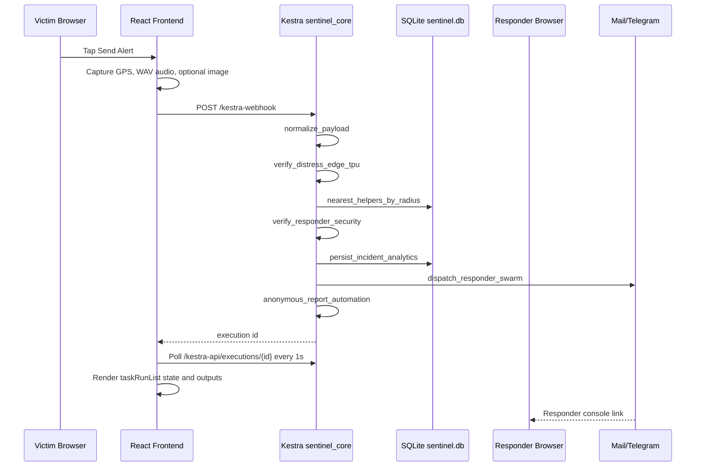
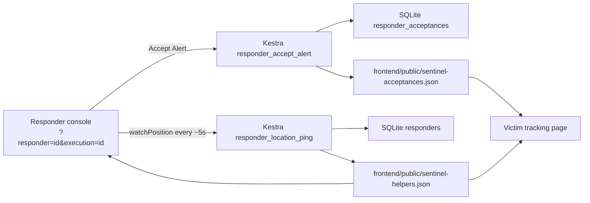
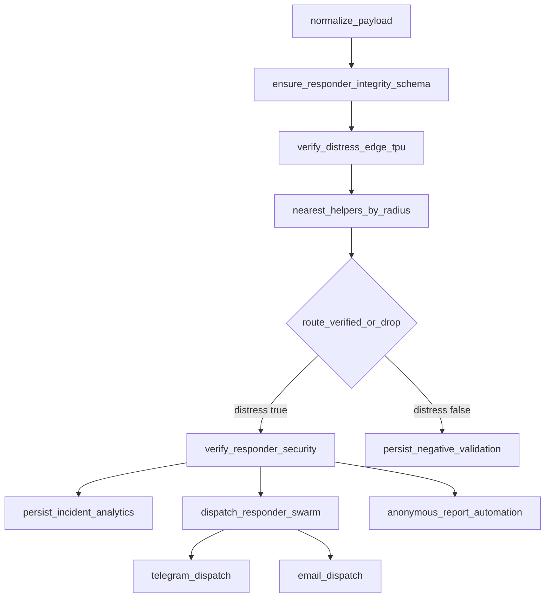
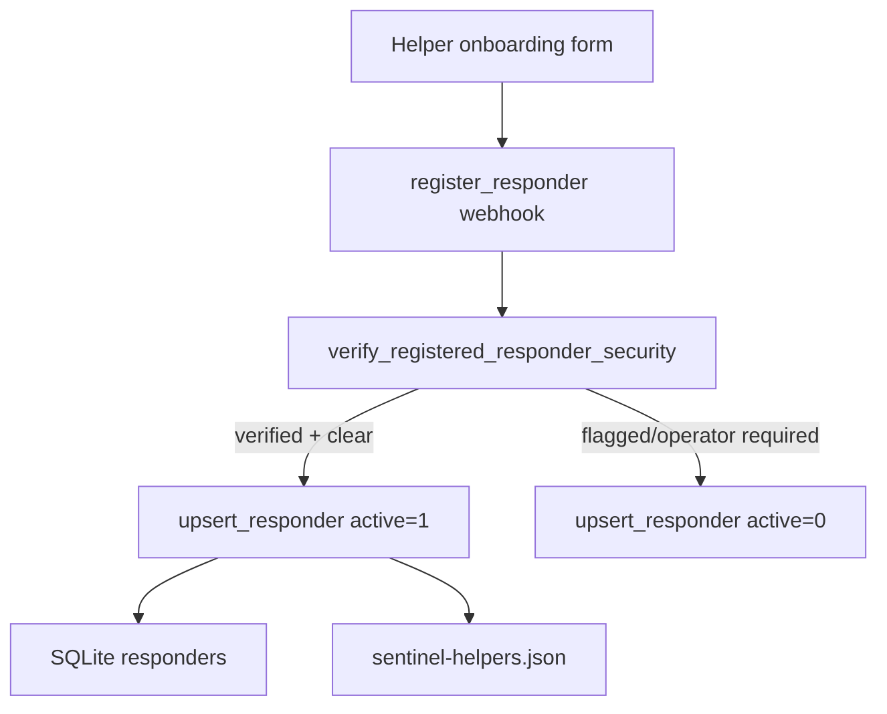
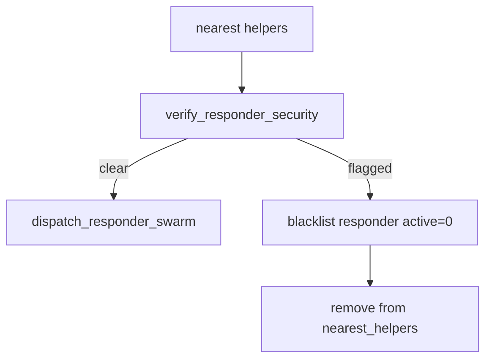
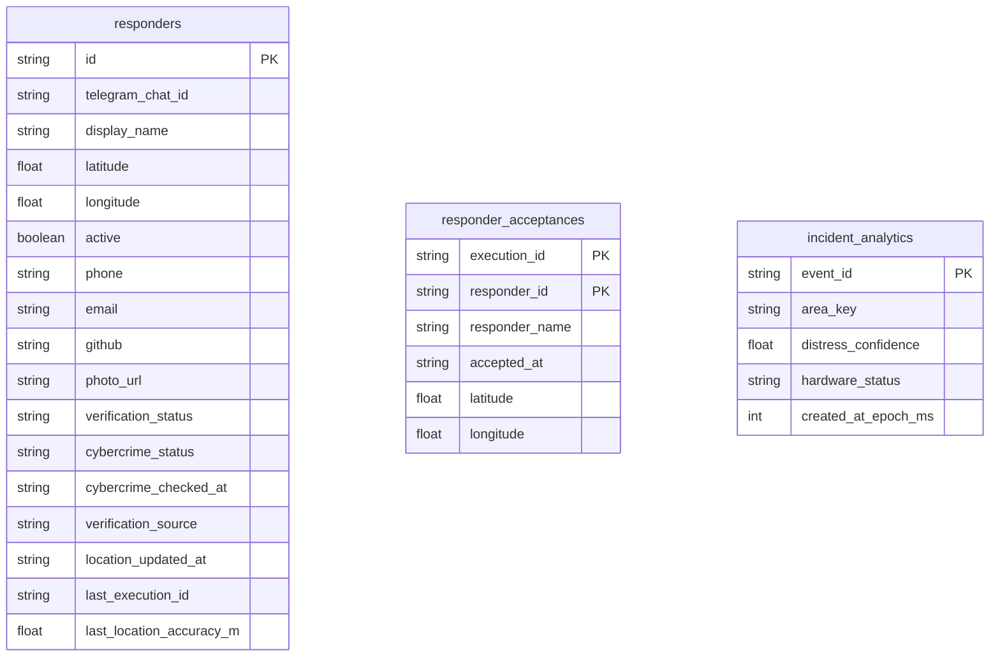

# Sentinel Grid Technical Design

## Mission

Sentinel Grid is designed as a real-time rescue coordination surface where the frontend is only the command surface and Kestra is the operational brain. Every important state transition should be visible as a Kestra task, Kestra output, SQLite row, or generated UI snapshot.

## System Boundaries

| Layer | Responsibility |
| --- | --- |
| React frontend | Sensor capture, tactical UI, Kestra polling, responder/victim route rendering |
| Kestra | Alert orchestration, responder verification, location heartbeat, acceptance persistence, dispatch, report drafting |
| SQLite | Operational state for responders, acceptances, incident analytics |
| Public UI snapshots | `sentinel-helpers.json` and `sentinel-acceptances.json` for browser polling |
| Services scripts | Task code used by Kestra, not a backend feature API |

## Alert Flow



## Responder Location And Acceptance



The responder location is not invented by the frontend. It comes from the responder browser geolocation API and is sent into Kestra, which updates SQLite and writes a UI snapshot. The victim page polls that snapshot and calculates distance/ETA client-side.

## Kestra Flow Topology



## Responder Verification

Registration flow:



Alert-time flow:



Current local `dev_mode=true` records a Kestra-owned dev clear to keep the full product path testable. Production mode should use the supervised Playwright path and fail closed as `operator_required` when captcha/operator input is required.

## Execution Sync Contract

The UI reads live execution data from:

```text
/kestra-api/executions/{execution_id}
```

Vite proxies that to:

```text
/api/v1/main/executions/{execution_id}
```

The tenant-aware `/main` segment is required. Without it, Kestra can return false “flow/execution not found” responses even when the execution exists.

## Frontend State Sources

| UI Section | Source |
| --- | --- |
| Live Incident | `normalize_payload`, selected helper, acceptance snapshot |
| Kestra Outputs | Kestra task outputs |
| Rescue Route | victim GPS from execution + responder GPS from helper snapshot |
| Audio Evidence | `normalize_payload.audio_data_url`, `verify_distress_edge_tpu` outputs |
| Verified Nearby Responders | `nearest_helpers` output or `sentinel-helpers.json` |
| Responder Console | URL query + Kestra execution + helper snapshot |
| Real Kestra Topology | `taskRunList` and task output vars |

## Data Model



## Deployment Notes

- Do not commit `.env`, SQLite data files, generated snapshots, `node_modules`, or build output.
- Kestra currently uses in-memory H2 in local Docker config, so flows must be redeployed after a container restart.
- Telegram dispatch requires a valid bot token and a real numeric chat id from a responder who has started the bot.
- Groq transcription requires a valid `GROQ_API_KEY`; failures are surfaced as `transcript_source` in Kestra outputs.

